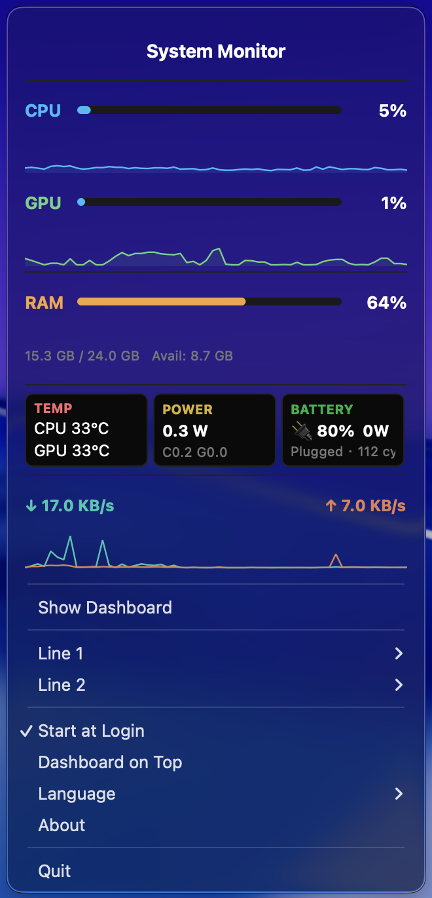
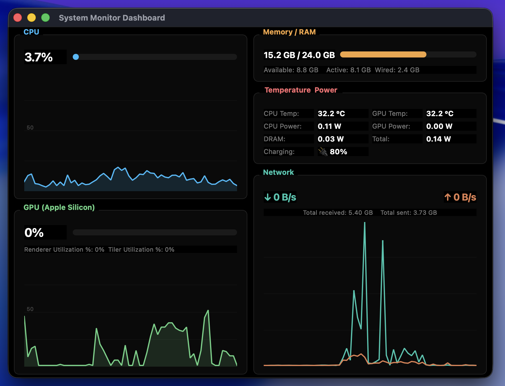

# macOS System Monitor

<p align="center">
  
  &nbsp;&nbsp;&nbsp;
  
</p>

A lightweight macOS menu bar app for real-time system monitoring.
Built for **Apple Silicon** (M1/M2/M3/M4), no sudo required.

一款轻量级 macOS 菜单栏系统监控工具，专为 Apple Silicon 设计，无需 sudo 权限。

Apple Silicon 向け軽量 macOS メニューバーシステムモニターアプリ。sudo 不要。

---

**[English](#english)** | **[中文](#中文)** | **[日本語](#日本語)**

---

<a name="english"></a>
## English

### Features

| Metric | Source | Detail |
|--------|--------|--------|
| **CPU** | `psutil` | Total usage % with sparkline chart |
| **GPU** | `ioreg` AGXAccelerator | Utilization % with sparkline chart |
| **RAM** | `psutil` | Used / Total / Available |
| **Temperature** | IOKit `IOHIDEventSystemClient` | CPU & GPU die temperature (°C) |
| **Power** | IOReport `Energy Model` | CPU / GPU / DRAM / Total (W) |
| **Battery** | `ioreg` AppleSmartBattery | Charging watt, %, time-to-full, cycle count |
| **Network** | `psutil` | Real-time upload & download speed with dual-line chart |

- **Customizable menu bar display** — choose 1-2 metrics to show in the menu bar
- **Menu bar dropdown** — click the icon to see all metrics at a glance
- **Dashboard window** — full detail view with large trend charts
- **Battery monitor** — dedicated card showing charging speed, battery %, estimated time to full, cycle count
- **Auto theme** — follows macOS system appearance (light / dark)
- **Always on Top** — pin the dashboard above other windows
- **Multi-language** — English, Chinese, Japanese
- **Start at Login** — native macOS login item (appears in System Settings)
- **No Dock icon** — runs purely as a background menu bar app

### Install

#### Option 1: DMG Installer (Recommended)

1. Download `SystemMonitor-1.3.1.dmg` from [Releases](https://github.com/zhxmarshall/macos-system-monitor/releases)
2. Double-click the DMG to open it
3. Drag **System Monitor** into the **Applications** folder
4. Launch from Launchpad or Spotlight (search "System Monitor")
5. First launch takes ~30s to install Python dependencies (requires internet)

#### Option 2: Build from Source

```bash
git clone https://github.com/zhxmarshall/macos-system-monitor.git
cd mac-system-monitor
./build.sh
open dist/System\ Monitor.app
```

#### Option 3: Run in Development Mode

```bash
git clone https://github.com/zhxmarshall/macos-system-monitor.git
cd mac-system-monitor
./run.sh
```

### Requirements

- macOS 12+ (Monterey or later)
- Apple Silicon Mac (M1/M2/M3/M4)
- Python 3.10+ (pre-installed on macOS or via [Homebrew](https://brew.sh): `brew install python`)

### Usage

Once running, the app appears as a metric value (e.g. CPU %, temperature) in the macOS menu bar.

- **Click** the menu bar icon to open the dropdown panel
- **Line 1 / Line 2** — choose which metrics to display in the menu bar (up to 2)
- **Show Dashboard** — opens a full detail window with large charts
- **Dashboard on Top** — pin the dashboard above other windows
- **Language** — switch between English, Chinese, Japanese
- **Start at Login** — toggle auto-start on boot
- **About** — version and developer info
- **Quit** — exit the app

### Troubleshooting

**App doesn't appear in menu bar?**
The icon shows metric values (e.g. "12%") in the top-right menu bar area. Check if running: `ps aux | grep app.py`

**Temperature shows "--"?**
Some macOS versions restrict thermal sensor access. All other metrics still work normally.

**First launch is slow?**
The app creates a virtual environment and downloads ~50MB of dependencies on first run. Subsequent launches are instant.

**"System Monitor.app is damaged" error?**
Run: `xattr -cr '/Applications/System Monitor.app'` to remove the quarantine flag.

**How to uninstall?**
1. Quit the app from the menu bar
2. Delete `/Applications/System Monitor.app`
3. Remove data: `rm -rf ~/Library/Application\ Support/SystemMonitor`

---

<a name="中文"></a>
## 中文

### 功能特性

| 指标 | 数据来源 | 说明 |
|------|----------|------|
| **CPU** | `psutil` | 总使用率 %，含折线图 |
| **GPU** | `ioreg` AGXAccelerator | 利用率 %，含折线图 |
| **内存** | `psutil` | 已用 / 总量 / 可用 |
| **温度** | IOKit `IOHIDEventSystemClient` | CPU 和 GPU 核心温度 (°C) |
| **功耗** | IOReport `Energy Model` | CPU / GPU / DRAM / 总功耗 (W) |
| **电池** | `ioreg` AppleSmartBattery | 充电功率、电量百分比、预计充满时间、循环次数 |
| **网络** | `psutil` | 实时上传和下载速度，含双线图 |

- **自定义菜单栏显示** — 可选择 1-2 个指标显示在菜单栏
- **菜单栏下拉面板** — 点击图标即可查看所有指标
- **Dashboard 面板** — 大尺寸趋势图的详细视图
- **电池监控** — 独立卡片显示充电功率、电量、预计充满时间、循环次数
- **自动主题** — 跟随 macOS 系统外观（浅色 / 深色）
- **窗口置顶** — 将 Dashboard 固定在最前面
- **多语言支持** — 英文、中文、日文
- **开机启动** — 原生 macOS 登录项（在系统设置中可见）
- **无 Dock 图标** — 纯后台菜单栏应用

### 安装方法

#### 方式一：DMG 安装包（推荐）

1. 从 [Releases](https://github.com/zhxmarshall/macos-system-monitor/releases) 下载 `SystemMonitor-1.3.1.dmg`
2. 双击打开 DMG 文件
3. 将 **System Monitor** 拖入 **Applications** 文件夹
4. 从启动台或 Spotlight 搜索 "System Monitor" 启动
5. 首次启动需约 30 秒安装依赖（需联网）

#### 方式二：从源码构建

```bash
git clone https://github.com/zhxmarshall/macos-system-monitor.git
cd mac-system-monitor
./build.sh
open dist/System\ Monitor.app
```

#### 方式三：开发模式运行

```bash
git clone https://github.com/zhxmarshall/macos-system-monitor.git
cd mac-system-monitor
./run.sh
```

### 系统要求

- macOS 12+（Monterey 或更高版本）
- Apple Silicon Mac（M1/M2/M3/M4）
- Python 3.10+（macOS 自带或通过 [Homebrew](https://brew.sh) 安装：`brew install python`）

### 使用说明

启动后，应用会在 macOS 菜单栏（屏幕右上角）显示监控数值。

- **点击** 菜单栏图标打开下拉面板
- **第一行 / 第二行** — 选择菜单栏显示的指标（最多 2 个）
- **打开面板** — 打开详细的 Dashboard 窗口
- **面板置顶** — 将 Dashboard 固定在最前面
- **语言** — 切换英文、中文、日文
- **开机启动** — 开关自动启动
- **关于** — 版本和开发者信息
- **退出** — 退出应用

### 常见问题

**菜单栏看不到应用？**
图标显示为数值（如 "12%"），在屏幕右上角菜单栏区域。检查是否在运行：`ps aux | grep app.py`

**温度显示 "--"？**
部分 macOS 版本限制了温度传感器的访问权限，其他指标不受影响。

**首次启动很慢？**
首次运行会创建虚拟环境并下载约 50MB 的依赖包，后续启动秒开。

**提示 "应用已损坏"？**
运行：`xattr -cr '/Applications/System Monitor.app'` 清除隔离标记。

**如何卸载？**
1. 从菜单栏退出应用
2. 删除 `/Applications/System Monitor.app`
3. 删除数据：`rm -rf ~/Library/Application\ Support/SystemMonitor`

---

<a name="日本語"></a>
## 日本語

### 機能

| 指標 | データソース | 詳細 |
|------|-------------|------|
| **CPU** | `psutil` | 総使用率 %、スパークラインチャート付き |
| **GPU** | `ioreg` AGXAccelerator | 使用率 %、スパークラインチャート付き |
| **メモリ** | `psutil` | 使用量 / 総量 / 空き容量 |
| **温度** | IOKit `IOHIDEventSystemClient` | CPU・GPU コア温度 (°C) |
| **電力** | IOReport `Energy Model` | CPU / GPU / DRAM / 合計 (W) |
| **バッテリー** | `ioreg` AppleSmartBattery | 充電ワット数、残量%、満充電予想時間、サイクル回数 |
| **ネットワーク** | `psutil` | リアルタイムアップロード・ダウンロード速度 |

- **メニューバー表示カスタマイズ** — 最大 2 つの指標をメニューバーに表示
- **メニューバードロップダウン** — アイコンクリックで全指標を一覧表示
- **ダッシュボード** — 大型トレンドチャート付き詳細ビュー
- **バッテリーモニター** — 充電速度、残量、満充電予想時間、サイクル回数を専用カードで表示
- **自動テーマ** — macOS システム外観に自動追従（ライト / ダーク）
- **最前面表示** — ダッシュボードを他のウィンドウの上に固定
- **多言語対応** — 英語・中国語・日本語
- **ログイン時に起動** — macOS ネイティブログイン項目（システム設定に表示）
- **Dock アイコンなし** — バックグラウンドメニューバーアプリとして動作

### インストール

#### 方法 1：DMG インストーラー（推奨）

1. [Releases](https://github.com/zhxmarshall/macos-system-monitor/releases) から `SystemMonitor-1.3.1.dmg` をダウンロード
2. DMG をダブルクリックして開く
3. **System Monitor** を **Applications** フォルダにドラッグ
4. Launchpad または Spotlight で "System Monitor" を検索して起動
5. 初回起動時に依存パッケージのインストールに約 30 秒かかります（インターネット接続必要）

#### 方法 2：ソースからビルド

```bash
git clone https://github.com/zhxmarshall/macos-system-monitor.git
cd mac-system-monitor
./build.sh
open dist/System\ Monitor.app
```

#### 方法 3：開発モードで実行

```bash
git clone https://github.com/zhxmarshall/macos-system-monitor.git
cd mac-system-monitor
./run.sh
```

### 動作要件

- macOS 12+（Monterey 以降）
- Apple Silicon Mac（M1/M2/M3/M4）
- Python 3.10+（macOS プリインストールまたは [Homebrew](https://brew.sh) 経由：`brew install python`）

### 使い方

起動すると、macOS メニューバー（画面右上）に監視データが表示されます。

- **クリック** でドロップダウンパネルを開く
- **1 行目 / 2 行目** — メニューバーに表示する指標を選択（最大 2 つ）
- **ダッシュボード** — 大型チャート付きの詳細ウィンドウを開く
- **ダッシュボード最前面** — ダッシュボードを最前面に固定
- **言語** — 英語・中国語・日本語を切り替え
- **ログイン時に起動** — 自動起動のオン・オフ
- **情報** — バージョンと開発者情報
- **終了** — アプリを終了

### トラブルシューティング

**メニューバーにアプリが表示されない？**
アイコンは数値（例："12%"）として右上のメニューバーに表示されます。実行確認：`ps aux | grep app.py`

**温度が "--" と表示される？**
一部の macOS バージョンでは温度センサーへのアクセスが制限されています。他の指標は正常に動作します。

**初回起動が遅い？**
初回実行時に仮想環境を作成し、約 50MB の依存パッケージをダウンロードします。2 回目以降は即座に起動します。

**「アプリが壊れています」エラー？**
実行：`xattr -cr '/Applications/System Monitor.app'` で検疫フラグを削除してください。

**アンインストール方法**
1. メニューバーからアプリを終了
2. `/Applications/System Monitor.app` を削除
3. データ削除：`rm -rf ~/Library/Application\ Support/SystemMonitor`

---

## Architecture

```
app.py              → Menu bar icon + dropdown panel + dashboard + about window
apple_metrics.py    → Apple Silicon data collectors (GPU / Temp / Power / Battery / Network)
test_app.py         → 35 unit tests
```

### Data Sources (No sudo needed)

| Data | Method |
|------|--------|
| CPU / RAM | `psutil` standard API |
| GPU Usage | `ioreg -c AGXAccelerator` → `PerformanceStatistics` |
| Power | IOReport API `"Energy Model"` channel via `ctypes` |
| Temperature | IOKit `IOHIDEventSystemClient` → PMU thermal sensors via `ctypes` |
| Battery | `ioreg -rn AppleSmartBattery` → charging watt, time-to-full, cycles |
| Network | `psutil.net_io_counters()` delta calculation |

All Apple Silicon metrics are read through macOS public frameworks using `ctypes` — no third-party native extensions or root privileges required.

## Project Structure

```
mac-system-monitor/
├── app.py               # Main application (menu bar + dashboard + about)
├── apple_metrics.py     # Apple Silicon metrics (GPU, temp, power, battery, network)
├── test_app.py          # Unit tests (35 tests)
├── requirements.txt     # Python dependencies (PyQt6, psutil, pyobjc)
├── run.sh               # Dev launcher (auto-creates venv)
├── build.sh             # Build .app bundle + DMG installer
├── icon.png             # App icon
├── AppIcon.icns         # macOS app icon
├── screenshots/         # App screenshots
├── LICENSE              # MIT License
└── README.md
```

## License

[MIT](LICENSE) — Marshall Zheng

## Acknowledgments

- [psutil](https://github.com/giampaolo/psutil) — Cross-platform system monitoring
- [PyQt6](https://www.riverbankcomputing.com/software/pyqt/) — Python Qt bindings
- Inspired by [Stats](https://github.com/exelban/stats), [asitop](https://github.com/tlkh/asitop), and Activity Monitor
